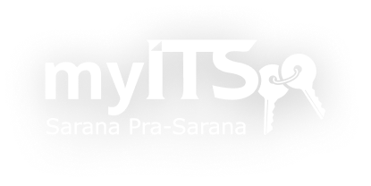

# 🏢 myITS Sarpras - Mobile App

[](https://flutter.dev/)
[](https://dart.dev/)
[](https://supabase.com/)

> **Final Project Teknologi Bergerak - Kelompok 8**
> Institut Teknologi Sepuluh Nopember (ITS)

<div align="center">
  
</div>

## 📖 Tentang Aplikasi
**myITS Sarpras** adalah aplikasi mobile yang dirancang untuk mendigitalisasi proses peminjaman sarana dan prasarana di lingkungan kampus ITS. Aplikasi ini mempermudah mahasiswa dan civitas akademika dalam mencari ruangan, mengajukan peminjaman, memantau status persetujuan, hingga melihat riwayat aktivitas secara *real-time*.

Aplikasi ini dibangun menggunakan **Flutter** untuk antarmuka yang responsif dan **Supabase** sebagai layanan backend yang menangani autentikasi, database, dan penyimpanan file.

## 🚀 Fitur Utama
* **Autentikasi Aman:** Login menggunakan email ITS.
* **Pencarian Ruangan:** Filter berdasarkan kapasitas dan fasilitas.
* **Booking Mudah:** Formulir pengajuan peminjaman terintegrasi.
* **Tracking Status:** Pantau status (Pending, Disetujui, Ditolak).
* **Profil Pengguna:** Manajemen data diri dan foto profil.
* **Pusat Informasi:** FAQ, Video Tutorial, dan Live Chat.


## 👥 Kontribusi Anggota Tim (Kelompok 8)
Berikut adalah rincian kontribusi setiap anggota dalam pengembangan aplikasi dan penyusunan laporan:

| Nama Anggota | NRP | Detail Kontribusi (Jobdesk) |
| :--- | :--- | :--- |
| **Karina Filza Aafiyah** | 5026221012 | • **Frontend:** Coding `home_page.dart` & `search_page.dart` (Fitur Mencari Ruang).<br>• **Backend:** Setup `main.dart` (Supabase Config), Setting Storage `room-images`, Menambah kolom `image_path` di tabel rooms.<br>• **Lainnya:** Editing Video Demo, Penulisan Laporan (Bab 3, 4.2-4.4, 5.3, 5.5). |
| **Mirna Irawan** | 5026221192 | • **Frontend:** UI Form Booking Ruangan, Halaman Success Booking, Detail Pemesanan.<br>• **Backend:** Setup Supabase & Overview BaaS.<br>• **Lainnya:** Penulisan Laporan (Bab 1 Pendahuluan, Bab 6 Kesimpulan, Subbab 5.6). |
| **Zaizafun Naura** | 5026221090 | • **Frontend:** Coding Halaman Riwayat (`riwayat_page.dart`) & Track Status (`track_status.dart`).<br>• **Lainnya:** Deskripsi Track Status (2.5), Penulisan Laporan (Subbab 2.1, 2.2.2 - 2.2.4). |
| **Jeremy Anggi** | 5026231155 | • **Frontend:** Membuat UI Fitur Login.<br>• **Setup:** Instalasi Flutter awal pada folder project myITS Sarpras. |
| **Favian Astama** | 5026231180 | • **Frontend:** Menyelesaikan kode Profile Page.<br>• **Backend:** Menambahkan kolom `avatars_url` di tabel profile (Fitur upload image).<br>• **Lainnya:** Deskripsi fitur login (2.1), Penulisan Laporan (Bab 4.1, 4.5, 4.6, & 5.4). |
| **Muhammad Ikhwanul Hafidz** | 5026231192 | • **Frontend:** Membuat Halaman "Alur Pinjam & FAQ", Animasi Welcome Screen, Notifikasi Success Booking.<br>• **Git:** Push folder project awal ke GitHub repository. |
| **Cristo Pison Ben Jarred** | 5026231200 | • **Frontend:** Membuat fitur Live Chat pada Homepage.<br>• **Lainnya:** Deskripsi Aplikasi myITS Sarpras, Penulisan Laporan (Bab 2 Metodologi). |


## 📂 Struktur Folder Proyek
Berikut adalah struktur direktori utama source code aplikasi ini beserta penjelasannya:

```text
myits_sarprass/
├── assets/                # Menyimpan aset statis (Logo, Icon, Placeholder)
├── docs/                  # Dokumentasi Tugas (ERD, Use Case, Bukti Database)
├── lib/                   # Source code utama aplikasi (Dart)
│   ├── models/            # Definisi model data (User, Peminjaman, Chat)
│   ├── pages/             # Halaman-halaman UI (User Interface)
│   │   ├── booking/       # Fitur form & detail peminjaman
│   │   ├── chat/          # Fitur live chat
│   │   ├── informations/  # Fitur informasi, FAQ, & upload pertanyaan
│   │   ├── login-register/# Fitur autentikasi pengguna
│   │   └── profile/       # Fitur manajemen profil & edit akun
│   ├── widgets/           # Komponen UI reusable (Card, Timeline, Input)
│   ├── main.dart          # Entry point aplikasi & pengaturan routing
│   └── supabase_config.dart # Konfigurasi koneksi ke Supabase
└── pubspec.yaml           # Daftar dependencies & library yang digunakan


## 🛠️ Tech Stack
* **Framework:** Flutter (Dart)
* **Backend:** Supabase
* **Database:** PostgreSQL (via Supabase)
* **Storage:** Supabase Storage (Buckets: `avatars`, `documents`, `room-images`)
* **Tools:** VS Code, Git, GitHub, Figma

## ⚙️ Instalasi & Menjalankan

1.  **Clone Repository**
    ```bash
    git clone [https://github.com/Ikhwanulhafidz09/TEKBER-KEL-8.git](https://github.com/Ikhwanulhafidz09/TEKBER-KEL-8.git)
    ```

2.  **Masuk ke Folder Project**
    ```bash
    cd myits_sarprass
    ```

3.  **Install Dependencies**
    ```bash
    flutter pub get
    ```

4.  **Jalankan Aplikasi**
    ```bash
    flutter run
    ```
